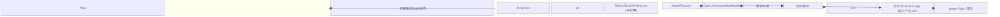
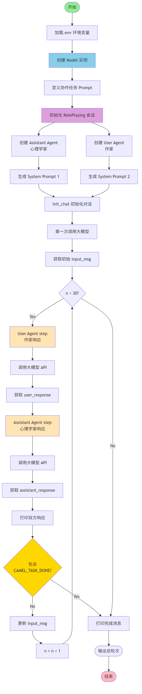
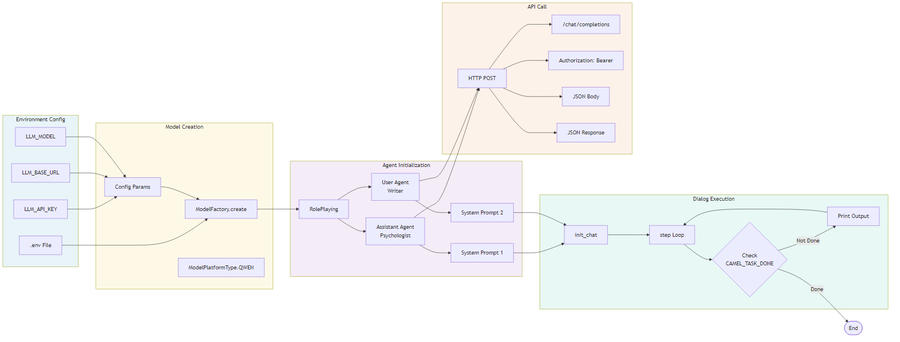
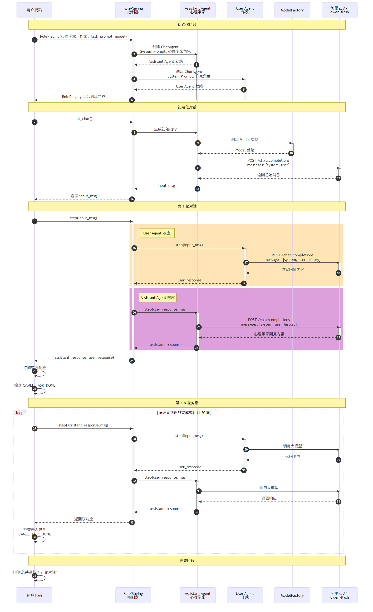
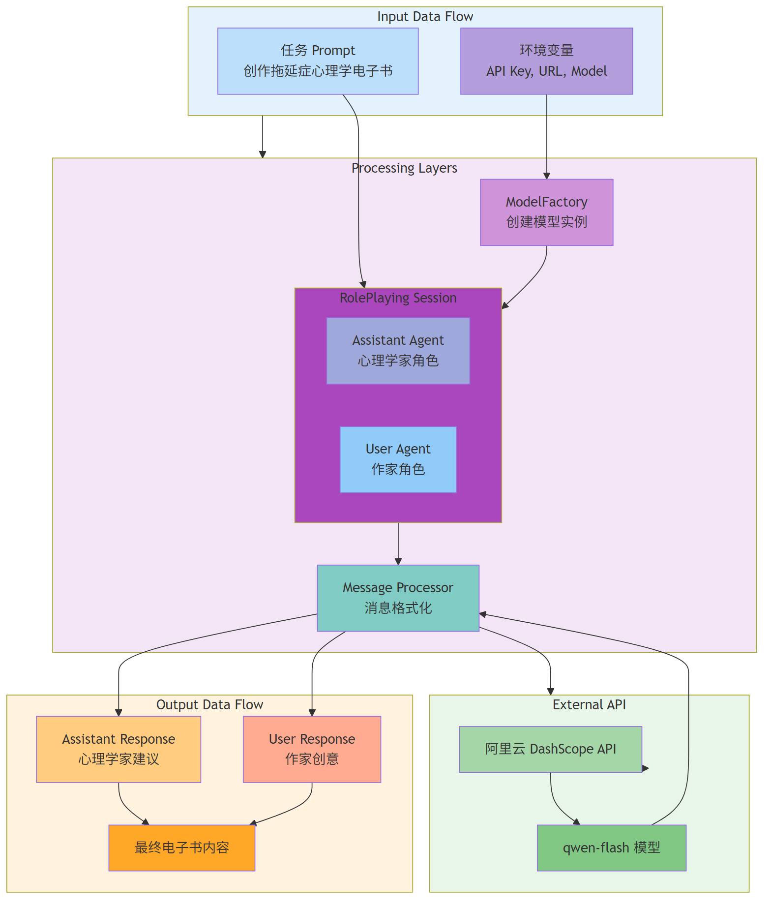

# CAMEL 多智能体 Demo - 技术图表集

本文档包含 CAMEL 多智能体电子书创作 Demo 的完整技术图表。

---

## 📊 图表目录

### 1. 系统架构图 (architecture_diagram.png)
展示了 CAMEL 系统的四层架构：
- **用户代码层**: DigitalBookWriting.py 主程序
- **CAMEL 框架层**: RolePlaying 控制器 + 双 Agent（心理学家/作家）
- **模型抽象层**: ModelFactory + OpenAI 兼容模型
- **大模型 API 层**: 阿里云 DashScope（通义千问）



---

### 2. 流程图 (flowchart_diagram.png)
详细展示了程序的完整执行流程：
- 环境配置 → 模型创建 → Agent 初始化
- 对话循环 → 响应检查 → 任务完成检测
- 包含决策点和循环逻辑



---

### 3. 调用关系图 (call_relationship_diagram.png)
展示了各组件之间的调用关系：
- 环境配置 → 模型创建 → Agent 初始化 → 对话执行 → API 调用
- 数据流向清晰可见



---

### 4. 序列图 (sequence_diagram.png)
按时间顺序展示了组件间的交互：
- 初始化阶段：创建 RolePlaying 会话和双 Agent
- 对话阶段：User Agent 和 Assistant Agent 交替调用大模型
- 完成阶段：检测 CAMEL_TASK_DONE 标记



---

### 5. 数据流图 (data_flow_diagram.png)
展示了数据在系统中的流动过程：
- Input: 任务 Prompt + 环境变量
- Processing: 模型工厂 → RolePlaying → 消息处理器
- API: 阿里云 DashScope → qwen-flash 模型
- Output: 双方响应 → 最终电子书



---

### 6. 组件交互图 (component_interaction_diagram.png)
展示了核心组件的交互关系：
- RolePlaying 控制器（对话管理、任务分解、历史追踪）
- ChatAgent 基类（System Message、Memory Buffer、Message Parser）
- Model 抽象（ModelFactory、BaseModelBackend、Response Handler）
- 外部 API（阿里云 DashScope）


---

## 🔑 关键技术点

### 大模型调用方式
```python
model = ModelFactory.create(
    model_platform=ModelPlatformType.QWEN,
    model_type="qwen-flash",
    url="https://dashscope.aliyuncs.com/compatible-mode/v1",
    api_key="sk-xxx"
)
```

### 多智能体协作
- **Assistant Agent**: 心理学家角色，提供专业建议
- **User Agent**: 作家角色，提出创意和问题
- **自主对话**: 通过 step() 方法交替响应

### 任务完成检测
```python
if "CAMEL_TASK_DONE" in user_response.msg.content:
    print("✅ 电子书创作完成！")
    break
```

---

## 📁 文件清单

| 文件名 | 说明 |
|--------|------|
| `architecture_diagram.png` | 系统架构图 |
| `flowchart_diagram.png` | 程序流程图 |
| `call_relationship_diagram.png` | 调用关系图 |
| `sequence_diagram.png` | 时序交互图 |
| `data_flow_diagram.png` | 数据流图 |
| `component_interaction_diagram.png` | 组件交互图 |

---

## 🎯 图表使用说明

1. **架构图**: 理解系统整体结构
2. **流程图**: 跟踪程序执行路径
3. **调用关系图**: 了解组件依赖关系
4. **序列图**: 查看时间顺序上的交互
5. **数据流图**: 追踪数据流动过程
6. **组件交互图**: 理解模块间协作

---

**生成时间**: 2026-03-10  
**CAMEL 版本**: 1.x  
**模型**: qwen-flash (通义千问快速版)
