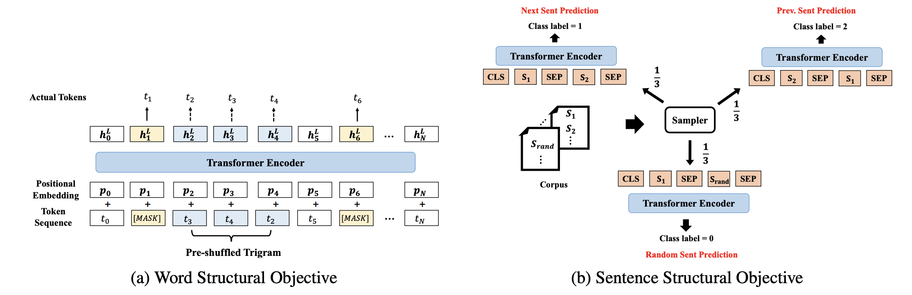

---
tasks:
- fill-mask
model-type:
- strutbert
domain:
- nlp
frameworks:
- pytorch
backbone:
- transformer
metrics:
- accuracy
license: Apache License 2.0
finetune-support: True
integrating: True
language: 
- ch
tags:
- transformer
- Alibaba
- arxiv:1908.04577
datasets:
  test:
  - modelscope/clue
pre-train: True
---

# 基于StructBERT的中文Base预训练模型介绍

StructBERT的中文Large预训练模型是使用wikipedia数据和masked language model任务训练的中文自然语言理解预训练模型。

## 模型描述

我们通过引入语言结构信息的方式，将BERT扩展为了一个新模型--StructBERT。我们通过引入两个辅助任务来让模型学习字级别的顺序信息和句子级别的顺序信息，从而更好的建模语言结构。详见论文[StructBERT: Incorporating Language Structures into Pre-training for Deep Language Understanding](https://arxiv.org/abs/1908.04577)


本模型为Base规模（Layer-12 / Hidden-768 / Head-12)，参数规模约为102M。

## 期望模型使用方式以及适用范围
本模型主要用于中文相关下游任务微调。用户可以基于自有训练数据进行微调。具体调用方式请参考代码示例。

### 如何使用
在安装完成ModelScope-lib之后即可基于nlp_structbert_backbone_base_std进行下游任务finetune

#### 代码范例
```python
from modelscope.metainfo import Preprocessors
from modelscope.msdatasets import MsDataset
from modelscope.trainers import build_trainer
from modelscope.utils.constant import Tasks


# 通过这个方法修改cfg
def cfg_modify_fn(cfg):
    # 将backbone模型加载到句子相似度的模型类中
    cfg.task = Tasks.sentence_similarity
    # 使用句子相似度的预处理器
    cfg['preprocessor'] = {'type': Preprocessors.sen_sim_tokenizer}

    # 演示代码修改，正常使用不用修改
    cfg.train.dataloader.workers_per_gpu = 0
    cfg.evaluation.dataloader.workers_per_gpu = 0

    # 补充数据集的特性
    cfg['dataset'] = {
        'train': {
            # 实际label字段内容枚举，在训练backbone时需要传入
            'labels': ['0', '1'],
            # 第一个字段的key
            'first_sequence': 'sentence1',
            # 第二个字段的key
            'second_sequence': 'sentence2',
            # label的key
            'label': 'label',
        }
    }
    # lr_scheduler的配置
    cfg.train.lr_scheduler.total_iters = int(len(dataset['train']) / 32) * cfg.train.max_epochs
    return cfg

#使用clue的afqmc进行训练
dataset = MsDataset.load('clue', subset_name='afqmc')
kwargs = dict(
    model='damo/nlp_structbert_backbone_base_std',
    train_dataset=dataset['train'],
    eval_dataset=dataset['validation'],
    work_dir='/tmp',
    cfg_modify_fn=cfg_modify_fn)

#使用nlp-base-trainer
trainer = build_trainer(name='nlp-base-trainer', default_args=kwargs)
trainer.train()
```

### 模型局限性以及可能的偏差
基于中文数据进行训练，模型训练数据有限，效果可能存在一定偏差。

## 训练数据介绍
数据来源于[https://huggingface.co/datasets/wikipedia](https://huggingface.co/datasets/wikipedia)

## 模型训练流程
在中文wiki等无监督数据上，通过MLM以及"模型描述"章节介绍的两个辅助任务训练了约300B字得到。
## 数据评估及结果
暂无

### 相关论文以及引用信息
如果我们的模型对您有帮助，请您引用我们的文章：
```BibTex
@article{wang2019structbert,
  title={Structbert: Incorporating language structures into pre-training for deep language understanding},
  author={Wang, Wei and Bi, Bin and Yan, Ming and Wu, Chen and Bao, Zuyi and Xia, Jiangnan and Peng, Liwei and Si, Luo},
  journal={arXiv preprint arXiv:1908.04577},
  year={2019}
}
```
