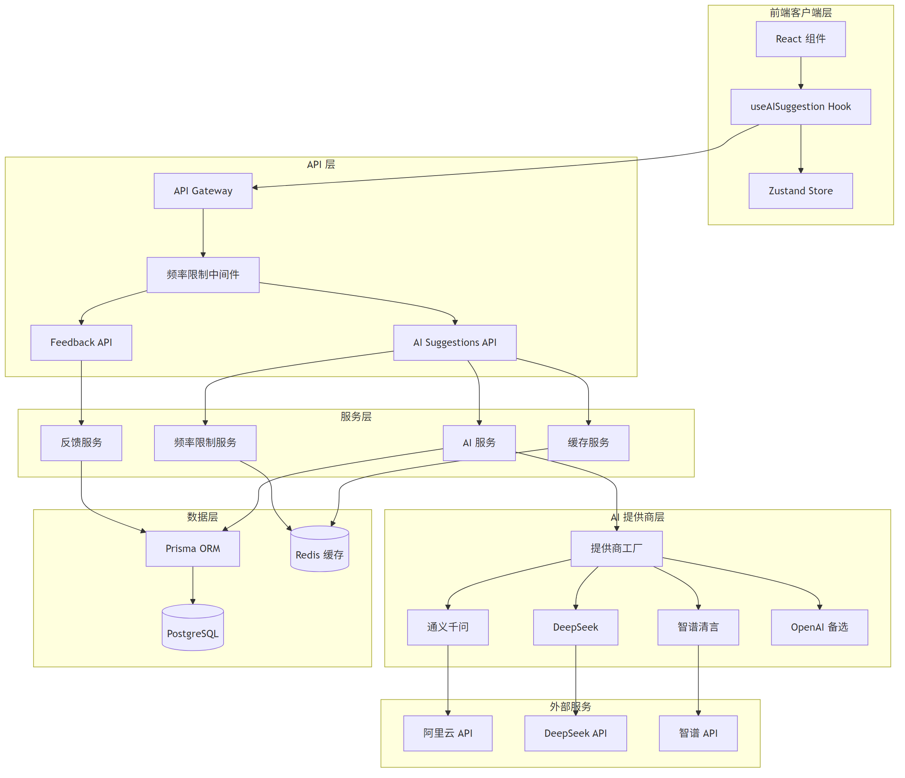
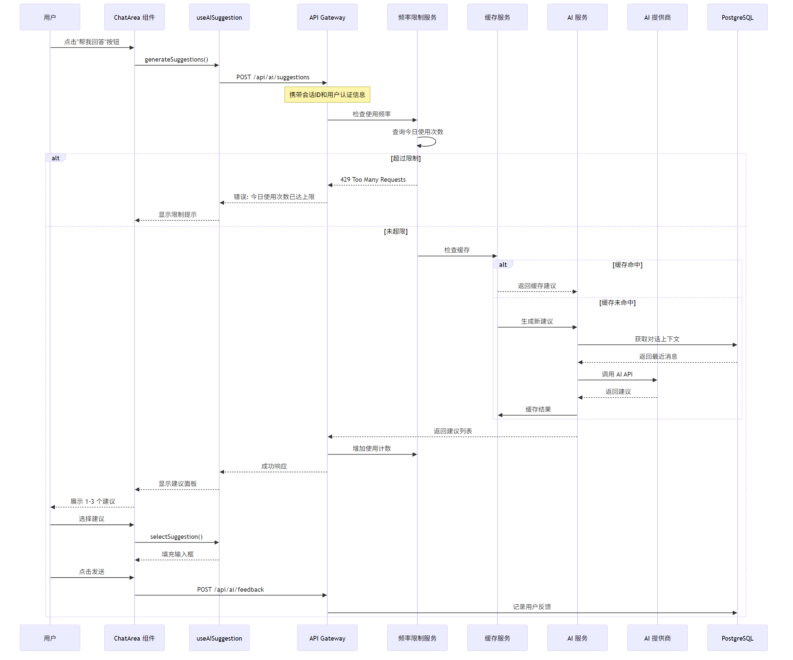

# AI 对话建议功能架构设计文档

**版本**: 1.0  
**创建日期**: 2026-02-22  
**架构师**: 软件架构专家  
**状态**: 设计阶段

---

## 一、执行摘要

### 1.1 文档目的

本文档基于产品经理审查报告（AI_SUGGESTION_AUDIT_REPORT.md）的要求，为 AI 对话建议功能提供完整的技术架构设计方案。

### 1.2 核心变更（相比原始计划）

| 变更项 | 原计划 | 调整后 | 原因 |
|--------|--------|--------|------|
| 建议数量 | 3-5 个 | **1-3 个** | 降低选择成本 |
| 建议分类 | 礼貌/幽默/专业/简洁 | **移除** | 简化 V1 功能 |
| 用户反馈 | 无 | **点赞/点踩** | 衡量功能价值 |
| 频率限制 | 无 | **每日 20 次** | 成本控制 |
| 隐私声明 | 无 | **必须添加** | 合规要求 |
| 降级方案 | 简单切换 | **完整降级策略** | 服务可用性 |

### 1.3 关键决策记录 (ADR)

#### ADR-001: 使用 Vercel AI SDK 作为 AI 集成框架

**背景**: 需要支持多个 AI 提供商，同时保持代码可维护性。

**决定**: 使用 Vercel AI SDK（已存在于 AISDK 目录）。

**影响**:
- 积极影响：提供商无关、类型安全、结构化输出、社区活跃
- 消极影响：需要学习新 API、部分提供商需要自定义适配
- 替代方案：直接调用各提供商 API（维护成本高）

**状态**: 已接受

---

## 二、系统架构设计

### 2.1 整体架构图



### 2.2 模块划分

```
src/
├── app/api/ai/                    # AI 相关 API 路由
│   ├── suggestions/route.ts       # 建议生成 API
│   ├── feedback/route.ts          # 用户反馈 API
│   └── config/route.ts            # 配置查询 API
│
├── services/ai/                   # AI 服务层（新增）
│   ├── index.ts                   # 服务导出
│   ├── ai-service.ts              # AI 核心服务
│   ├── provider-factory.ts        # 提供商工厂
│   ├── cache-service.ts           # 缓存服务
│   ├── rate-limit-service.ts      # 频率限制服务
│   └── feedback-service.ts        # 反馈服务
│
├── providers/ai/                  # AI 提供商实现（新增）
│   ├── index.ts                   # 提供商导出
│   ├── base-provider.ts           # 基础提供商抽象
│   ├── alibaba-provider.ts        # 通义千问
│   ├── deepseek-provider.ts       # DeepSeek
│   ├── zhipu-provider.ts          # 智谱清言
│   └── openai-provider.ts         # OpenAI 备选
│
├── hooks/                         # React Hooks
│   ├── useAISuggestion.ts         # AI 建议 Hook（修改）
│   └── useRateLimit.ts            # 频率限制 Hook（新增）
│
├── components/chat/               # 聊天组件
│   ├── ChatArea.tsx               # 聊天区域（修改）
│   ├── AISuggestionPanel.tsx      # 建议面板（修改）
│   └── AISuggestionButton.tsx     # 建议按钮（新增）
│
├── stores/                        # 状态管理
│   └── index.ts                   # 添加 AI 相关状态
│
├── types/ai.ts                    # AI 类型定义（新增）
│
└── lib/ai/                        # AI 工具库（新增）
    ├── prompt-templates.ts        # Prompt 模板
    ├── suggestion-parser.ts       # 建议解析器
    └── privacy-utils.ts           # 隐私处理工具
```

### 2.3 数据流设计



### 2.4 API 设计

#### 2.4.1 生成建议 API

```typescript
// POST /api/ai/suggestions
// 请求体
interface SuggestionsRequest {
  conversationId: string;      // 会话 ID
  messageCount?: number;       // 上下文消息数量，默认 10
}

// 响应体
interface SuggestionsResponse {
  success: boolean;
  data: {
    suggestions: AISuggestion[];
    remainingCount: number;    // 今日剩余次数
    cached: boolean;           // 是否来自缓存
  };
  error?: {
    code: string;
    message: string;
  };
}

// 建议类型
interface AISuggestion {
  id: string;
  content: string;
  reasoning?: string;          // 可选的推理说明
}
```

#### 2.4.2 用户反馈 API

```typescript
// POST /api/ai/feedback
// 请求体
interface FeedbackRequest {
  suggestionId: string;        // 建议 ID
  conversationId: string;      // 会话 ID
  action: 'like' | 'dislike' | 'use' | 'ignore';
  editedContent?: string;      // 用户编辑后的内容
}

// 响应体
interface FeedbackResponse {
  success: boolean;
  data?: {
    thanked: boolean;          // 是否显示感谢信息
  };
  error?: {
    code: string;
    message: string;
  };
}
```

#### 2.4.3 配置查询 API

```typescript
// GET /api/ai/config
// 响应体
interface AIConfigResponse {
  success: boolean;
  data: {
    dailyLimit: number;        // 每日限制次数
    usedToday: number;         // 今日已使用次数
    remainingToday: number;    // 今日剩余次数
    provider: string;          // 当前提供商
    privacyNotice: string;     // 隐私声明
  };
}
```

---

## 三、技术选型评估

### 3.1 AI SDK 选型

| 特性 | Vercel AI SDK | 直接 API 调用 | LangChain |
|------|---------------|---------------|-----------|
| 提供商支持 | 多个内置 | 需自行集成 | 多个内置 |
| 类型安全 | 完整 TypeScript | 需自行定义 | 部分支持 |
| 结构化输出 | 原生支持 (Zod) | 需自行解析 | 支持 |
| 学习曲线 | 中等 | 低 | 高 |
| 包大小 | ~50KB | 0 | ~200KB |
| 维护成本 | 低 | 高 | 中 |
| **推荐度** | **推荐** | 不推荐 | 备选 |

**结论**: 继续使用 Vercel AI SDK，已满足所有需求。

### 3.2 AI 提供商优先级

```
优先级排序：
1. 通义千问 (alibaba) - 免费、中文强、稳定
2. DeepSeek - 免费、推理强、价格低
3. 智谱清言 (zhipu) - GLM-4-Flash 免费
4. OpenAI - 备选、付费、稳定
```

### 3.3 提供商切换机制

```typescript
// 提供商工厂模式
class ProviderFactory {
  private providers: Map<string, AIProvider> = new Map();
  private fallbackChain: string[] = ['alibaba', 'deepseek', 'zhipu', 'openai'];
  
  /**
   * 获取提供商实例
   * 按优先级自动选择可用提供商
   */
  getProvider(): AIProvider {
    for (const name of this.fallbackChain) {
      const provider = this.providers.get(name);
      if (provider?.isAvailable()) {
        return provider;
      }
    }
    throw new Error('No available AI provider');
  }
  
  /**
   * 熔断机制
   * 当某提供商连续失败时，暂时禁用
   */
  circuitBreaker(providerName: string, duration: number = 60000) {
    const provider = this.providers.get(providerName);
    if (provider) {
      provider.disable(duration);
    }
  }
}
```

### 3.4 新增依赖评估

| 依赖 | 用途 | 是否必需 | 包大小 |
|------|------|----------|--------|
| ai | AI SDK 核心 | 已安装 | ~50KB |
| @ai-sdk/alibaba | 通义千问 | 已安装 | ~5KB |
| @ai-sdk/deepseek | DeepSeek | 已安装 | ~5KB |
| ioredis | Redis 客户端 | **推荐** | ~100KB |
| @upstash/redis | Serverless Redis | 备选 | ~20KB |

**建议**: 引入 Redis 客户端用于频率限制和缓存。如果部署在 Vercel 等 Serverless 环境，推荐使用 Upstash Redis。

---

## 四、性能优化方案

### 4.1 响应时间优化

```
目标响应时间：< 3 秒 (P95)

优化策略：
1. 上下文压缩：只发送最近 10 条消息
2. 并行处理：同时获取上下文和检查频率限制
3. 流式响应：可选，V2 功能
4. 边缘计算：将 AI 服务部署到边缘节点
```

### 4.2 缓存策略

```typescript
interface CacheStrategy {
  // 缓存键生成：基于对话最后 N 条消息的哈希
  generateKey(conversationId: string, lastMessages: Message[]): string;
  
  // 缓存时间：5 分钟（避免重复请求）
  ttl: 300;
  
  // 缓存条件：
  // 1. 相同的最后一条消息
  // 2. 5 分钟内重复请求
  // 3. 用户未发送新消息
}

// 缓存实现示例
class SuggestionCache {
  private redis: RedisClient;
  
  async get(key: string): Promise<AISuggestion[] | null> {
    const cached = await this.redis.get(`suggestion:${key}`);
    return cached ? JSON.parse(cached) : null;
  }
  
  async set(key: string, suggestions: AISuggestion[]): Promise<void> {
    await this.redis.setex(
      `suggestion:${key}`,
      300, // 5 分钟 TTL
      JSON.stringify(suggestions)
    );
  }
}
```

### 4.3 并发处理

```typescript
// 使用 Promise.all 并行处理
async generateSuggestions(conversationId: string, userId: string) {
  const [messages, rateLimitStatus] = await Promise.all([
    this.getConversationContext(conversationId),
    this.checkRateLimit(userId)
  ]);
  
  if (!rateLimitStatus.allowed) {
    throw new RateLimitError(rateLimitStatus);
  }
  
  // 生成建议...
}
```

### 4.4 降级方案

```typescript
interface FallbackStrategy {
  // 降级级别
  levels: {
    // Level 1: 切换到备用提供商
    level1: {
      action: 'switch_provider';
      target: 'deepseek' | 'zhipu' | 'openai';
    };
    // Level 2: 返回缓存结果
    level2: {
      action: 'return_cache';
      maxAge: 3600; // 1 小时内的缓存
    };
    // Level 3: 返回预设建议
    level3: {
      action: 'return_fallback';
      suggestions: string[];
    };
    // Level 4: 显示友好错误
    level4: {
      action: 'show_error';
      message: 'AI 服务暂时不可用，请稍后重试';
    };
  };
}

// 预设建议模板
const FALLBACK_SUGGESTIONS = [
  '好的，我明白了。',
  '谢谢你的消息，我会尽快回复。',
  '收到，稍后给你答复。'
];
```

---

## 五、安全性设计

### 5.1 API Key 管理

```typescript
// 环境变量配置
// .env.local
ALIBABA_API_KEY=sk-xxx        # 通义千问
DEEPSEEK_API_KEY=sk-xxx       # DeepSeek
ZHIPU_API_KEY=xxx             # 智谱清言
OPENAI_API_KEY=sk-xxx         # OpenAI (备选)

// API Key 轮换策略
interface APIKeyRotation {
  // 每个提供商支持多个 API Key
  keys: string[];
  // 当前使用的 Key 索引
  currentIndex: number;
  // Key 轮换条件：错误率 > 5%
  rotationThreshold: 0.05;
}
```

### 5.2 用户隐私保护

```typescript
// 隐私处理流程
class PrivacyHandler {
  /**
   * 发送到 AI 前的数据脱敏
   * - 移除用户真实姓名
   * - 移除敏感信息（电话、邮箱等）
   */
  sanitizeContext(messages: Message[]): SanitizedMessage[] {
    return messages.map(msg => ({
      role: msg.senderId === this.currentUserId ? 'user' : 'other',
      content: this.removeSensitiveInfo(msg.content)
    }));
  }
  
  /**
   * 移除敏感信息
   */
  private removeSensitiveInfo(content: string): string {
    // 正则匹配并替换
    const patterns = {
      phone: /1[3-9]\d{9}/g,
      email: /[\w.-]+@[\w.-]+\.\w+/g,
      idCard: /\d{17}[\dXx]/g,
    };
    
    let sanitized = content;
    for (const [type, pattern] of Object.entries(patterns)) {
      sanitized = sanitized.replace(pattern, `[${type}]`);
    }
    return sanitized;
  }
}

// 隐私声明
const PRIVACY_NOTICE = `
您的对话内容将被发送到 AI 服务以生成回复建议。
我们承诺：
1. 不会永久存储您的对话内容
2. 不会将您的数据用于模型训练
3. 数据传输使用加密连接
4. 您可以随时在设置中关闭此功能
`;
```

### 5.3 频率限制实现

```typescript
// 基于 Redis 的频率限制
class RateLimiter {
  private redis: RedisClient;
  private dailyLimit: number = 20;
  
  /**
   * 检查用户是否超过限制
   */
  async checkLimit(userId: string): Promise<RateLimitStatus> {
    const today = new Date().toISOString().split('T')[0];
    const key = `rate_limit:${userId}:${today}`;
    
    const count = await this.redis.incr(key);
    
    // 首次访问设置过期时间（到当天结束）
    if (count === 1) {
      const secondsUntilMidnight = this.getSecondsUntilMidnight();
      await this.redis.expire(key, secondsUntilMidnight);
    }
    
    return {
      allowed: count <= this.dailyLimit,
      used: count,
      remaining: Math.max(0, this.dailyLimit - count),
      resetAt: this.getMidnight()
    };
  }
  
  private getSecondsUntilMidnight(): number {
    const now = new Date();
    const midnight = new Date(now);
    midnight.setHours(24, 0, 0, 0);
    return Math.floor((midnight.getTime() - now.getTime()) / 1000);
  }
}
```

### 5.4 数据加密

```typescript
// 传输层加密
// - HTTPS 强制使用
// - API Key 不在前端暴露

// 敏感数据加密存储
class DataEncryption {
  private algorithm = 'aes-256-gcm';
  private key: Buffer;
  
  encrypt(data: string): string {
    const iv = crypto.randomBytes(16);
    const cipher = crypto.createCipheriv(this.algorithm, this.key, iv);
    let encrypted = cipher.update(data, 'utf8', 'hex');
    encrypted += cipher.final('hex');
    return `${iv.toString('hex')}:${encrypted}:${cipher.getAuthTag().toString('hex')}`;
  }
  
  decrypt(encrypted: string): string {
    const [ivHex, data, authTagHex] = encrypted.split(':');
    const decipher = crypto.createDecipheriv(
      this.algorithm,
      this.key,
      Buffer.from(ivHex, 'hex')
    );
    decipher.setAuthTag(Buffer.from(authTagHex, 'hex'));
    let decrypted = decipher.update(data, 'hex', 'utf8');
    decrypted += decipher.final('utf8');
    return decrypted;
  }
}
```

---

## 六、可扩展性设计

### 6.1 支持更多 AI 提供商

```typescript
// 提供商抽象接口
interface AIProvider {
  name: string;
  
  // 检查是否可用
  isAvailable(): boolean;
  
  // 生成建议
  generateSuggestions(context: MessageContext): Promise<AISuggestion[]>;
  
  // 健康检查
  healthCheck(): Promise<boolean>;
  
  // 获取使用统计
  getUsageStats(): Promise<UsageStats>;
}

// 新增提供商只需实现此接口
class NewAIProvider implements AIProvider {
  name = 'new-provider';
  
  isAvailable(): boolean {
    return !!process.env.NEW_PROVIDER_API_KEY;
  }
  
  async generateSuggestions(context: MessageContext): Promise<AISuggestion[]> {
    // 实现具体逻辑
  }
  
  // ...
}
```

### 6.2 支持更多功能扩展

```typescript
// 功能扩展点
interface AIExtension {
  // 功能名称
  name: string;
  
  // 功能类型
  type: 'suggestion' | 'summary' | 'translation' | 'sentiment';
  
  // 是否启用
  enabled: boolean;
  
  // 执行功能
  execute(context: any): Promise<any>;
}

// 示例：对话摘要扩展
class ConversationSummaryExtension implements AIExtension {
  name = 'conversation-summary';
  type = 'summary';
  enabled = true;
  
  async execute(conversationId: string): Promise<string> {
    // 生成对话摘要
  }
}
```

### 6.3 代码可维护性

```typescript
// 遵循 SOLID 原则

// 单一职责：每个服务只负责一个功能
class RateLimitService { /* 只负责频率限制 */ }
class CacheService { /* 只负责缓存 */ }
class AIService { /* 只负责 AI 调用 */ }

// 开闭原则：通过接口扩展，不修改现有代码
interface AIService {
  generateSuggestions(context: MessageContext): Promise<AISuggestion[]>;
}

// 里氏替换：所有提供商可互相替换
class AlibabaProvider implements AIProvider { }
class DeepSeekProvider implements AIProvider { }

// 接口隔离：接口最小化
interface ISuggestions {
  generate(context: MessageContext): Promise<AISuggestion[]>;
}

interface IFeedback {
  submit(feedback: Feedback): Promise<void>;
}

// 依赖倒置：依赖抽象而非具体实现
class AIService {
  constructor(
    private provider: AIProvider,      // 抽象
    private cache: ICacheService,      // 抽象
    private rateLimiter: IRateLimiter  // 抽象
  ) {}
}
```

---

## 七、数据库设计

### 7.1 新增数据表

```prisma
// AI 建议使用记录
model AISuggestionUsage {
  id        String   @id @default(uuid())
  userId    String   @map("user_id")
  conversationId String @map("conversation_id")
  suggestionId String? @map("suggestion_id")
  provider  String   // 使用的提供商
  cached    Boolean  @default(false)
  createdAt DateTime @default(now()) @map("created_at")
  
  user User @relation(fields: [userId], references: [id], onDelete: Cascade)
  
  @@index([userId, createdAt])
  @@index([conversationId])
  @@map("ai_suggestion_usage")
}

// AI 建议反馈
model AISuggestionFeedback {
  id           String   @id @default(uuid())
  userId       String   @map("user_id")
  suggestionId String   @map("suggestion_id")
  conversationId String @map("conversation_id")
  action       String   // like, dislike, use, ignore
  editedContent String? @map("edited_content") @db.Text
  createdAt    DateTime @default(now()) @map("created_at")
  
  user User @relation(fields: [userId], references: [id], onDelete: Cascade)
  
  @@index([userId])
  @@index([suggestionId])
  @@map("ai_suggestion_feedback")
}

// 更新 User 模型，添加关系
model User {
  // ... 现有字段 ...
  
  aiSuggestionUsage AISuggestionUsage[]
  aiSuggestionFeedback AISuggestionFeedback[]
}
```

### 7.2 Redis 数据结构

```
# 频率限制
rate_limit:{userId}:{date} -> count (TTL: 到当天结束)

# 建议缓存
suggestion:{conversationId}:{messageHash} -> JSON (TTL: 300s)

# 提供商健康状态
provider:health:{providerName} -> status (TTL: 60s)

# 用户偏好
user:preference:{userId} -> JSON (TTL: 永久)
```

---

## 八、风险评估

### 8.1 技术风险

| 风险 | 可能性 | 影响 | 缓解措施 |
|------|--------|------|----------|
| AI API 响应超时 | 中 | 高 | 设置 5 秒超时，显示加载状态，提供取消选项 |
| AI 建议质量差 | 中 | 高 | 优化 Prompt，收集反馈，A/B 测试 |
| 提供商服务中断 | 低 | 高 | 多提供商支持，熔断机制，降级方案 |
| 缓存穿透 | 低 | 中 | 限制缓存键长度，设置空值缓存 |

### 8.2 性能风险

| 风险 | 可能性 | 影响 | 缓解措施 |
|------|--------|------|----------|
| 高并发导致 API 限流 | 中 | 中 | 频率限制，请求队列，降级方案 |
| 数据库查询慢 | 低 | 中 | 索引优化，查询限制，连接池 |
| 内存泄漏 | 低 | 高 | 定期重启，内存监控，代码审查 |

### 8.3 安全风险

| 风险 | 可能性 | 影响 | 缓解措施 |
|------|--------|------|----------|
| API Key 泄露 | 低 | 高 | 环境变量存储，定期轮换，访问日志 |
| 用户数据泄露 | 低 | 高 | 数据脱敏，传输加密，访问控制 |
| 恶意请求 | 中 | 中 | 频率限制，请求验证，IP 黑名单 |

### 8.4 依赖风险

| 风险 | 可能性 | 影响 | 缓解措施 |
|------|--------|------|----------|
| Vercel AI SDK 重大更新 | 低 | 中 | 锁定版本，定期更新，测试覆盖 |
| 提供商 API 变更 | 低 | 中 | 抽象层隔离，版本兼容，监控告警 |
| Redis 服务中断 | 低 | 中 | 本地缓存降级，多实例部署 |

---

## 九、监控与告警

### 9.1 关键指标

```typescript
// 监控指标定义
interface AIMetrics {
  // 性能指标
  responseTime: {
    p50: number;  // 目标: < 1s
    p95: number;  // 目标: < 3s
    p99: number;  // 目标: < 5s
  };
  
  // 使用指标
  usage: {
    dailyActiveUsers: number;
    dailyRequests: number;
    dailySuggestions: number;
    averageSuggestionsPerUser: number;
  };
  
  // 质量指标
  quality: {
    likeRate: number;        // 目标: > 70%
    useRate: number;         // 目标: > 30%
    ignoreRate: number;      // 目标: < 50%
  };
  
  // 错误指标
  errors: {
    rateLimitHits: number;
    providerErrors: number;
    timeoutErrors: number;
  };
}
```

### 9.2 告警规则

```yaml
# 告警配置
alerts:
  - name: high_error_rate
    condition: error_rate > 5%
    duration: 5m
    severity: critical
    actions:
      - notify: dev-team
      - enable_fallback: true
  
  - name: slow_response
    condition: p95_response_time > 5s
    duration: 10m
    severity: warning
    actions:
      - notify: dev-team
  
  - name: rate_limit_spike
    condition: rate_limit_hits > 100 in 1h
    duration: 1h
    severity: warning
    actions:
      - notify: product-team
  
  - name: provider_down
    condition: provider_health == false
    duration: 1m
    severity: critical
    actions:
      - notify: dev-team
      - switch_provider: true
```

---

## 十、实施计划

### 10.1 开发阶段

| 阶段 | 任务 | 预计时间 | 依赖 |
|------|------|----------|------|
| **阶段一** | 基础架构 | 2-3h | 无 |
| - | 创建服务层目录结构 | 0.5h | - |
| - | 实现提供商工厂模式 | 1h | - |
| - | 配置环境变量 | 0.5h | - |
| **阶段二** | 核心服务实现 | 3-4h | 阶段一 |
| - | AI 服务核心逻辑 | 1.5h | - |
| - | 频率限制服务 | 1h | Redis |
| - | 缓存服务 | 1h | Redis |
| **阶段三** | API 实现 | 2-3h | 阶段二 |
| - | 建议生成 API | 1h | - |
| - | 反馈 API | 0.5h | - |
| - | 配置 API | 0.5h | - |
| **阶段四** | 前端实现 | 3-4h | 阶段三 |
| - | useAISuggestion Hook | 1h | - |
| - | AISuggestionPanel 组件 | 1.5h | - |
| - | ChatArea 集成 | 1h | - |
| **阶段五** | 测试与优化 | 2-3h | 阶段四 |
| - | 单元测试 | 1h | - |
| - | 集成测试 | 1h | - |
| - | 性能优化 | 1h | - |
| **总计** | | **12-17h** | |

### 10.2 上线检查清单

- [ ] 所有 API 端点测试通过
- [ ] 频率限制功能正常
- [ ] 缓存功能正常
- [ ] 降级方案测试通过
- [ ] 隐私声明已添加
- [ ] 监控告警已配置
- [ ] 文档已更新
- [ ] 代码审查已完成

---

## 十一、总结

本架构设计文档基于产品经理审查报告的要求，提供了 AI 对话建议功能的完整技术方案：

### 核心设计决策

1. **简化设计**: 建议数量 1-3 个，移除分类功能
2. **用户反馈**: 添加点赞/点踩机制
3. **成本控制**: 每日 20 次使用限制
4. **隐私保护**: 数据脱敏、隐私声明
5. **高可用**: 多提供商支持、熔断机制、降级方案

### 技术亮点

1. **提供商无关**: 通过工厂模式支持多个 AI 提供商
2. **性能优化**: 缓存策略、并行处理、上下文压缩
3. **安全设计**: API Key 管理、数据加密、频率限制
4. **可扩展性**: 清晰的接口定义、模块化设计

### 风险控制

1. **技术风险**: 熔断机制、降级方案
2. **性能风险**: 频率限制、缓存策略
3. **安全风险**: 数据脱敏、加密传输
4. **依赖风险**: 抽象层隔离、版本锁定

---

**文档版本历史**

| 版本 | 日期 | 作者 | 变更说明 |
|------|------|------|----------|
| 1.0 | 2026-02-22 | 软件架构专家 | 初始版本 |

---

*文档结束*
