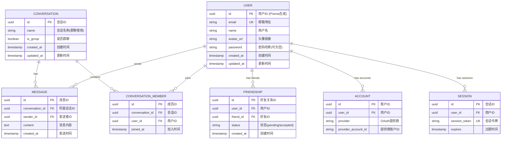

# Nexus Chat 领域模型文档

**版本**: 2.1  
**更新日期**: 2026-02-23  
**状态**: 已实现

---

## 1. 领域模型概览

### 1.1 核心实体关系图



---

## 2. 实体定义

### 2.1 User (用户)

**描述**: 系统用户实体，存储用户基本信息和认证信息。

**属性**:

| 属性 | 类型 | 约束 | 说明 |
|------|------|------|------|
| id | UUID | PK, Default: uuid() | 用户唯一标识 |
| email | String | UK, NOT NULL | 用户邮箱，用于登录 |
| name | String | NULL | 用户昵称 |
| avatarUrl | String | NULL | 头像 URL |
| password | String | NULL | 密码哈希（OAuth 用户为 null） |
| createdAt | DateTime | Default: now() | 创建时间 |
| updatedAt | DateTime | UpdatedAt | 更新时间 |

**TypeScript 接口**:

```typescript
interface User {
  id: string
  email: string
  name: string | null
  avatarUrl: string | null
  password: string | null  // 仅用于邮箱密码登录
  createdAt: Date
  updatedAt: Date
}
```

**业务规则**:
- email 必须唯一
- password 使用 bcrypt 哈希存储（10 轮加密）
- OAuth 登录用户 password 为 null

---

### 2.2 Conversation (会话)

**描述**: 聊天会话实体，支持私聊和群聊。

**属性**:

| 属性 | 类型 | 约束 | 说明 |
|------|------|------|------|
| id | UUID | PK, Default: uuid() | 会话唯一标识 |
| name | String | NULL | 会话名称（群聊时使用） |
| isGroup | Boolean | Default: false | 是否为群聊 |
| createdAt | DateTime | Default: now() | 创建时间 |
| updatedAt | DateTime | UpdatedAt | 更新时间（用于排序） |

**TypeScript 接口**:

```typescript
interface Conversation {
  id: string
  name: string | null
  isGroup: boolean
  createdAt: Date
  updatedAt: Date
}
```

**业务规则**:
- 私聊会话 name 为 null
- 群聊会话必须有 name
- updatedAt 随新消息更新

---

### 2.3 Message (消息)

**描述**: 聊天消息实体。

**属性**:

| 属性 | 类型 | 约束 | 说明 |
|------|------|------|------|
| id | UUID | PK, Default: uuid() | 消息唯一标识 |
| conversationId | UUID | FK, NOT NULL | 所属会话 ID |
| senderId | UUID | FK, NOT NULL | 发送者 ID |
| content | String | NOT NULL | 消息内容 |
| createdAt | DateTime | Default: now() | 发送时间 |

**TypeScript 接口**:

```typescript
interface Message {
  id: string
  conversationId: string
  senderId: string
  content: string
  createdAt: Date
}
```

**业务规则**:
- 消息内容最大长度 5000 字符
- 消息不可修改，只能删除
- 删除会话时级联删除消息

---

### 2.4 ConversationMember (会话成员)

**描述**: 会话与用户的关联实体。

**属性**:

| 属性 | 类型 | 约束 | 说明 |
|------|------|------|------|
| id | UUID | PK, Default: uuid() | 成员记录唯一标识 |
| conversationId | UUID | FK, NOT NULL | 会话 ID |
| userId | UUID | FK, NOT NULL | 用户 ID |
| role | Enum | Default: 'member' | 角色：owner/admin/member ⚠️ 未实现API |
| isMuted | Boolean | Default: false | 是否被禁言 ⚠️ 未实现API |
| mutedUntil | DateTime | NULL | 禁言截止时间 ⚠️ 未实现API |
| mutedBy | UUID | FK, NULL | 禁言操作者 ⚠️ 未实现API |
| joinedAt | DateTime | Default: now() | 加入时间 |

**TypeScript 接口**:

```typescript
interface ConversationMember {
  id: string
  conversationId: string
  userId: string
  role: 'owner' | 'admin' | 'member'  // ⚠️ 未实现API
  isMuted: boolean  // ⚠️ 未实现API
  mutedUntil: Date | null  // ⚠️ 未实现API
  mutedBy: string | null  // ⚠️ 未实现API
  joinedAt: Date
}
```

**业务规则**:
- 同一用户不能重复加入同一会话
- 私聊会话有且仅有 2 个成员

---

### 2.5 Friendship (好友关系)

**描述**: 用户之间的好友关系。

**属性**:

| 属性 | 类型 | 约束 | 说明 |
|------|------|------|------|
| id | UUID | PK, Default: uuid() | 关系唯一标识 |
| userId | UUID | FK, NOT NULL | 用户 ID |
| friendId | UUID | FK, NOT NULL | 好友 ID |
| status | String | Default: 'pending' | 状态：pending/accepted |
| createdAt | DateTime | Default: now() | 创建时间 |

**TypeScript 接口**:

```typescript
interface Friendship {
  id: string
  userId: string
  friendId: string
  status: 'pending' | 'accepted'
  createdAt: Date
}
```

**业务规则**:
- 好友关系是单向的，需要双方互加
- 添加好友时创建 `pending` 状态记录
- 接受好友请求后：
  1. 更新原记录状态为 `accepted`
  2. 自动创建反向关系（`status: 'accepted'`）
- 同一对用户只能有一条关系记录
- 拒绝好友请求时删除 `pending` 记录

---

### 2.6 Account (OAuth 账户)

**描述**: OAuth 第三方账户信息。

**属性**:

| 属性 | 类型 | 约束 | 说明 |
|------|------|------|------|
| id | UUID | PK | 账户唯一标识 |
| userId | UUID | FK, NOT NULL | 关联用户 ID |
| type | String | NOT NULL | 账户类型 |
| provider | String | NOT NULL | OAuth 提供商 |
| providerAccountId | String | NOT NULL | 提供商账户 ID |
| access_token | String | NULL | 访问令牌 |
| refresh_token | String | NULL | 刷新令牌 |
| expires_at | Int | NULL | 令牌过期时间 |

**业务规则**:
- 由 NextAuth.js 自动管理
- 同一提供商账户只能绑定一个用户

---

### 2.7 Session (会话令牌)

**描述**: NextAuth.js 会话管理。

**属性**:

| 属性 | 类型 | 约束 | 说明 |
|------|------|------|------|
| id | UUID | PK | 会话唯一标识 |
| sessionToken | String | UK, NOT NULL | 会话令牌 |
| userId | UUID | FK, NOT NULL | 用户 ID |
| expires | DateTime | NOT NULL | 过期时间 |

**业务规则**:
- 由 NextAuth.js 自动管理
- 默认有效期 30 天

---

## 3. 值对象

### 3.1 FriendWithUser

**描述**: 好友信息，包含用户详情。

```typescript
type FriendWithUser = Friendship & {
  friend: Pick<User, 'id' | 'name' | 'avatarUrl' | 'createdAt'>
}
```

### 3.2 ConversationWithMembers

**描述**: 会话信息，包含成员和最后消息。

```typescript
type ConversationWithMembers = Conversation & {
  members: (ConversationMember & {
    user: Pick<User, 'id' | 'name' | 'avatarUrl'>
  })[]
  messages: Pick<Message, 'id' | 'content' | 'createdAt' | 'senderId'>[]
}
```

### 3.3 MessageWithSender

**描述**: 消息信息，包含发送者详情。

```typescript
type MessageWithSender = Message & {
  sender: Pick<User, 'id' | 'name' | 'avatarUrl'>
}
```

---

## 4. 聚合根

### 4.1 Conversation Aggregate

**聚合根**: Conversation

**包含实体**:
- ConversationMember (成员列表)
- Message (消息列表)

**不变性约束**:
- 私聊会话必须有且仅有 2 个成员
- 群聊会话至少有 2 个成员
- 消息发送者必须是会话成员

---

## 5. 领域服务

### 5.1 UserService

**职责**: 用户相关业务逻辑

| 方法 | 描述 |
|------|------|
| getById(id) | 获取用户信息 |
| getByEmail(email) | 通过邮箱获取用户 |
| create(data) | 创建用户 |
| search(query, currentUserId) | 搜索用户 |

### 5.2 MessageService

**职责**: 消息相关业务逻辑

| 方法 | 描述 |
|------|------|
| getConversationMessages(conversationId, options) | 获取会话消息 |
| sendMessage(conversationId, senderId, content) | 发送消息 |
| deleteMessage(id) | 删除消息 |

### 5.3 ConversationService

**职责**: 会话相关业务逻辑

| 方法 | 描述 |
|------|------|
| getById(id) | 获取会话 |
| listByUser(userId) | 获取用户会话列表 |
| createPrivateConversation(userId1, userId2) | 创建私聊 |
| createGroupConversation(name, creatorId, memberIds) | 创建群聊 |

### 5.4 FriendService

**职责**: 好友相关业务逻辑

| 方法 | 描述 |
|------|------|
| getFriends(userId) | 获取好友列表（双向查询） |
| getPendingRequests(userId) | 获取待处理好友请求 |
| addFriend(userId, friendId) | 添加好友（创建 pending 记录） |
| acceptFriend(friendshipId, userId) | 接受好友请求（更新状态+创建反向关系） |
| rejectFriend(friendshipId, userId) | 拒绝好友请求（删除 pending 记录） |
| removeFriend(userId, friendId) | 删除好友（删除双向关系） |
| isFriend(userId, friendId) | 判断是否为好友 |

---

## 6. 仓储接口

### 6.1 UserRepository

```typescript
interface UserRepository {
  getById(id: string): Promise<User | null>
  getByEmail(email: string): Promise<User | null>
  getByIds(ids: string[]): Promise<User[]>
  create(data: CreateUserData): Promise<User>
  update(id: string, data: UpdateUserData): Promise<User>
  search(query: string, currentUserId: string, limit?: number): Promise<UserWithFriendStatus[]>
}
```

### 6.2 MessageRepository

```typescript
interface MessageRepository {
  getById(id: string): Promise<Message | null>
  getByIdWithSender(id: string): Promise<MessageWithSender | null>
  getByConversation(conversationId: string, options?: PaginationOptions): Promise<MessageWithSender[]>
  create(data: CreateMessageData): Promise<MessageWithSender>
  delete(id: string): Promise<void>
}
```

### 6.3 ConversationRepository

```typescript
interface ConversationRepository {
  getById(id: string): Promise<Conversation | null>
  getByIdWithDetails(id: string): Promise<ConversationWithMembers | null>
  getPrivateConversation(userId1: string, userId2: string): Promise<Conversation | null>
  listByUser(userId: string): Promise<ConversationWithMembers[]>
  create(data: CreateConversationData): Promise<Conversation>
  update(id: string, data: UpdateConversationData): Promise<Conversation>
}
```

### 6.4 FriendshipRepository

```typescript
interface FriendshipRepository {
  getFriends(userId: string): Promise<FriendWithUser[]>
  getPendingRequests(userId: string): Promise<FriendWithUser[]>
  addFriend(userId: string, friendId: string): Promise<Friendship>
  acceptFriend(friendshipId: string, userId: string): Promise<void>
  rejectFriend(friendshipId: string, userId: string): Promise<void>
  removeFriend(userId: string, friendId: string): Promise<void>
  isFriend(userId: string, friendId: string): Promise<boolean>
}
```

---

## 7. Prisma Schema 定义

```prisma
model User {
  id        String   @id @default(uuid())
  email     String   @unique
  name      String?
  avatarUrl String?  @map("avatar_url")
  password  String?
  createdAt DateTime @default(now()) @map("created_at")
  updatedAt DateTime @updatedAt @map("updated_at")

  sentMessages     Message[]           @relation("SentMessages")
  conversations    ConversationMember[]
  friendships      Friendship[]        @relation("UserFriends")
  friendOf         Friendship[]        @relation("FriendOfUsers")
  sessions         Session[]
  accounts         Account[]

  @@map("users")
}

model Conversation {
  id        String   @id @default(uuid())
  name      String?
  isGroup   Boolean  @default(false) @map("is_group")
  createdAt DateTime @default(now()) @map("created_at")
  updatedAt DateTime @updatedAt @map("updated_at")

  members  ConversationMember[]
  messages Message[]

  @@map("conversations")
}

model Message {
  id             String   @id @default(uuid())
  conversationId String   @map("conversation_id")
  senderId       String   @map("sender_id")
  content        String
  createdAt      DateTime @default(now()) @map("created_at")

  conversation Conversation @relation(fields: [conversationId], references: [id], onDelete: Cascade)
  sender       User         @relation("SentMessages", fields: [senderId], references: [id], onDelete: Cascade)

  @@index([conversationId])
  @@index([createdAt])
  @@map("messages")
}

model ConversationMember {
  id             String   @id @default(uuid())
  conversationId String   @map("conversation_id")
  userId         String   @map("user_id")
  joinedAt       DateTime @default(now()) @map("joined_at")

  conversation Conversation @relation(fields: [conversationId], references: [id], onDelete: Cascade)
  user         User         @relation(fields: [userId], references: [id], onDelete: Cascade)

  @@unique([conversationId, userId])
  @@map("conversation_members")
}

model Friendship {
  id        String   @id @default(uuid())
  userId    String   @map("user_id")
  friendId  String   @map("friend_id")
  status    String   @default("pending")
  createdAt DateTime @default(now()) @map("created_at")

  user   User @relation("UserFriends", fields: [userId], references: [id], onDelete: Cascade)
  friend User @relation("FriendOfUsers", fields: [friendId], references: [id], onDelete: Cascade)

  @@unique([userId, friendId])
  @@map("friendships")
}

model Account {
  id                String  @id @default(uuid())
  userId            String  @map("user_id")
  type              String
  provider          String
  providerAccountId String  @map("provider_account_id")
  refresh_token     String? @map("refresh_token") @db.Text
  access_token      String? @map("access_token") @db.Text
  expires_at        Int?    @map("expires_at")
  token_type        String? @map("token_type")
  scope             String?
  id_token          String? @map("id_token") @db.Text
  session_state     String? @map("session_state")

  user User @relation(fields: [userId], references: [id], onDelete: Cascade)

  @@unique([provider, providerAccountId])
  @@map("accounts")
}

model Session {
  id           String   @id @default(uuid())
  sessionToken String   @unique @map("session_token")
  userId       String   @map("user_id")
  expires      DateTime

  user User @relation(fields: [userId], references: [id], onDelete: Cascade)

  @@map("sessions")
}

model VerificationToken {
  identifier String
  token      String   @unique
  expires    DateTime

  @@unique([identifier, token])
  @@map("verification_tokens")
}
```

---

*文档结束*
