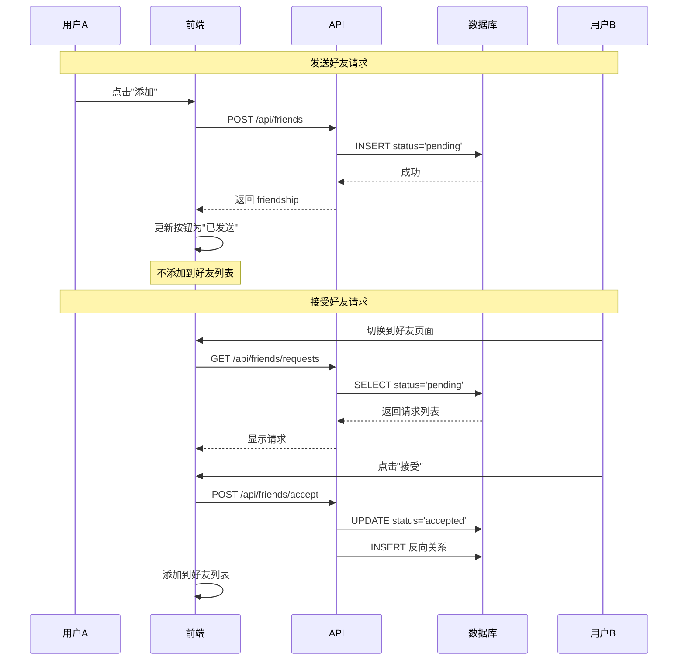

# 好友请求功能修复规格文档

**版本**: 1.1  
**创建日期**: 2026-02-21  
**更新日期**: 2026-02-23  
**状态**: 已完成 ✅

---

## 1. 问题分析

### 1.1 当前状态

好友请求和同意功能的**后端已完整实现**：

| API | 方法 | 功能 | 状态 |
|-----|------|------|------|
| `/api/friends` | POST | 发送好友请求（创建 pending 记录） | ✅ 正常 |
| `/api/friends/requests` | GET | 获取待处理好友请求 | ✅ 正常 |
| `/api/friends/accept` | POST | 接受好友请求 | ✅ 正常 |
| `/api/friends/accept` | DELETE | 拒绝好友请求 | ✅ 正常 |

### 1.2 问题根因

前端 `handleAddFriend` 函数存在 bug：

```typescript
// 问题代码：发送请求后直接添加到好友列表
const handleAddFriend = async (friendId: string) => {
    await fetch('/api/friends', { ... })
    
    // ❌ 错误：pending 状态不应该添加到好友列表
    addFriend({
        id: resultUser.id,
        name: resultUser.name,
        ...
    })
}
```

**影响**：用户发送好友请求后，对方立即出现在自己的好友列表中，但实际上对方还未确认。

### 1.3 正确流程

```
用户A 发送好友请求:
1. POST /api/friends → 创建 { status: 'pending' }
2. 前端显示"已发送请求"状态（不是添加到好友列表）

用户B 看到请求:
3. GET /api/friends/requests → 显示待处理请求
4. 点击接受 → POST /api/friends/accept
5. 双方成为好友，出现在好友列表
```

---

## 2. 修复方案

### 2.1 修改文件

| 文件 | 修改内容 |
|------|----------|
| `src/components/chat/Sidebar.tsx` | 修复 `handleAddFriend` 逻辑 |
| `src/stores/index.ts` | 新增 `sentRequests` 状态（已发送的请求） |

### 2.2 详细修改

#### 2.2.1 Sidebar.tsx - handleAddFriend 函数

**修改前**：
```typescript
const handleAddFriend = async (friendId: string) => {
    await fetch('/api/friends', { ... })
    // 错误：直接添加到好友列表
    addFriend({ ... })
}
```

**修改后**：
```typescript
const handleAddFriend = async (friendId: string) => {
    await fetch('/api/friends', { ... })
    // 正确：只更新按钮状态为"已发送"
    setSearchResults(prev => prev.map(u =>
        u.id === friendId ? { ...u, requestSent: true } : u
    ))
}
```

#### 2.2.2 搜索结果按钮状态

| 状态 | 按钮文字 | 按钮状态 |
|------|----------|----------|
| 无关系 | "添加" | 可点击 |
| 已是好友 | "已添加" | 禁用 |
| 已发送请求 | "已发送" | 禁用 |

#### 2.2.3 用户搜索 API 增强

返回数据需要包含：
- `isFriend`: 是否已是好友
- `hasPendingRequest`: 是否已发送请求（新增）

---

## 3. 数据流图



---

## 5. 验收标准

### 5.1 功能验收

- [x] 发送好友请求后，按钮显示"已发送"
- [x] 发送好友请求后，对方**不**出现在好友列表
- [x] 对方登录后，能看到好友请求
- [x] 对方接受后，双方都能在好友列表看到对方
- [x] 对方拒绝后，请求消失，发起方无感知

### 5.2 边界情况

- [x] 重复发送请求：显示"已发送"或"好友关系已存在"
- [x] 搜索已发送请求的用户：显示"已发送"状态
- [x] 搜索已是好友的用户：显示"已添加"状态

---

## 6. 验证结果

### 6.1 功能验证 (2026-02-23)

| 验证项 | 结果 | 说明 |
|--------|------|------|
| 发送请求后按钮状态 | ✅ 通过 | 点击后显示"已发送"并禁用 |
| 好友列表不立即更新 | ✅ 通过 | pending 状态不加入好友列表 |
| 待处理请求页面 | ✅ 通过 | GET /api/friends/requests 正常返回 |
| 接受请求功能 | ✅ 通过 | POST /api/friends/accept 正常工作 |
| 拒绝请求功能 | ✅ 通过 | DELETE /api/friends/accept 正常工作 |

### 6.2 API 验证

| API | 方法 | 状态 |
|-----|------|------|
| `/api/friends` | POST | ✅ 正常 |
| `/api/friends/requests` | GET | ✅ 正常 |
| `/api/friends/accept` | POST | ✅ 正常 |
| `/api/friends/accept` | DELETE | ✅ 正常 |

---

## 7. 影响范围

| 范围 | 影响 |
|------|------|
| 后端 API | 无需修改（已正确实现） |
| 前端组件 | Sidebar.tsx 需修改 |
| 状态管理 | 可选增加 sentRequests 状态 |
| 数据库 | 无需修改 |

---

*文档结束*
